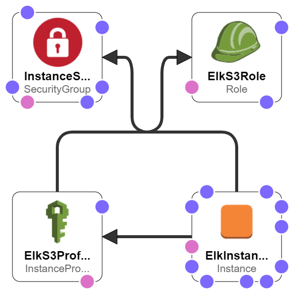

# VOL-ASTIC
Volatility integrated with ElasticSearch(ES) and Kibana in an AWS environment

## Overview/How it works
Volatilty gives users the ability to ask for their output in a specific format such as text, json, html, etc. This unified output concept allows for users to run plugins and output the results how they see fit. Examples of existing renderers and their outputs can be found on their volatility wiki found [here](https://github.com/volatilityfoundation/volatility/wiki/Unified-Output).

The aim of this project was to create an ElasticSearch renderer that can format volatility output to an ES format that can automatically export the results to ES. I then decided to create a Kibana dashboard to better visualize the results exported.

The main focus will be running this plugin in the cloud, however, if you wish to setup your local environment, refer to the following [ElasticSearch](https://www.elastic.co/guide/en/elasticsearch/reference/current/setup.html) and [Kibana](https://www.elastic.co/guide/en/kibana/current/setup.html) guides.

After being able to run this locally, I decided to automate the process of building up an Elastic stack leveraging AWS. I did this to test the renderer in a linux environment, and also to make it so that anyone can leverage the automation and run this renderer with minimal effort.

Huge credit to Dolos Development for supplying the base of the code for the Volatility ES Renderer.
Dolos Development repo can be found [here](https://github.com/dolosdevelopment/volatility).

## AWS Automation
This section will assume that the user has created their own AWS account. Of note, to the best of my knowledge, GMU has joined AWS Educate for quite a few years now, giving students a grant of $100 in AWS credits. Feel free to read more on AWS Educate and join [here](https://aws.amazon.com/education/awseducate/) :) 

### Create EC2 KeyPair
Before beginning AWS deployment, a user must first create an EC2 keypair to ssh to any EC2 instance. To create a keypair, refer to AWS documentation [here](https://docs.aws.amazon.com/AWSEC2/latest/UserGuide/ec2-key-pairs.html).

### Create S3 Bucket
Create an S3 bucket by following the AWS documentation [here](https://docs.aws.amazon.com/quickstarts/latest/s3backup/step-1-create-bucket.html). This will simply serve the purpose of storing your memory files and any other files that you'd like. Feel free to remove the dependency on S3 and use any external storage of your choice.

### Deploying - EC2 Instance

Under the aws folder exists an `elk_ec2.yml` file that provisions the AWS EC2 instance. The easiest way to provision an EC2 instance is to use the AWS console. Head over to the `CloudFormation` resource and click on `Create stack`. There are two options of specifying a CloudFormation template:

- Amazon S3 URL: Upload the preferred version of the `elk_ec2.yml` file and just provide the object url of that file to CloudFormation.
- Upload a template file: Allows the user to choose their version of `elk_ec2.yml` file from their local machine.

For stack details, define the stack name however you choose :)\
Next, there are four parameters required to fill in, each serve a purpose to let the user define their inputs.

- KeyName: This is the only component that the user must create on their own for their specific AWS account. The user must first define a EC2 keypair, and use that name for this parameter. This is the key that will be used to ssh to your instance.
- InstanceType: This will define the instance type that you wish to deploy. The default is the minimum requirement to run ES/Kibana.
- SSHLocation: This defines the range of ip addresses that can ssh to the EC2 instance. Default is all ip addresses.
- S3BucketName: The name of the S3 bucket that the EC2 instance can upload/download files to/from.

Next, define tag names for your stack if you'd like, or skip onto the next step.

Review your stack details and then check the box that "Acknowledge(s) that AWS CloudFormation might create IAM resources". Then click create stack.

### Sit back and relax
CloudFormation will begin to deploy your template, and will notify the user if there were any issues. Once everything completed successfully, the EC2 instance will take a few minutes to fully run the user data. Once completed, the instance will be running both ElasticSearch and Kibana

To Login to the instance using your ec2 key pair, run the following command:
```
ssh -i [path-to-key] ec2-user@[public-DNS-name]
```

### Import Kibana Dashboards
This an optional step. With Kibana, a user has the ability to import existing dashboards that have been created. Kibana also allows for exporting dashbaords created. This is useful for dashboards that are created within AWS, allowing for dashboards to be saved externally (e.g. AWS S3 buckets). I've created some dashboards and stored them in my S3 bucket. The file is also stored under the `Kibana` folder in this repo. 

Verify that Kibana is running on the instance with the following command:
```
sudo service kibana status
```

To import your kibana dashboard, run the following command, replacing the file name as needed:
```
curl -X POST "localhost:5601/api/saved_objects/_import" -H "kbn-xsrf: true" --form file=@/home/ec2-user/cfrs772-demo.ndjson
```

To view the UI of Kibana, you will have to ssh port-forward from another command prompt/terminal to get into your AWS VPC. As an example, run the following command from another cmd prompt/terminal:
```
ssh -i [path-to-keypair] -L 8080:localhost:5601 ec2-user@[public-DNS-name]
```

## Running Volatility
To run Volatility using the ES renderer, run the following command:
```
/home/ec2-user/git-volastic/volastic/vol.py -f "/home/ec2-user/git-volastic/volastic/vm.vmem" --profile=[profile] --output=elastic --elastic-url="http://127.0.0.1:9200" [plugin]
```

Example commands:
```
pstree
/home/ec2-user/git-volastic/volastic/vol.py -f "/home/ec2-user/git-volastic/volastic/vm.vmem" --profile=WinXPSP2x86 --output=elastic --elastic-url="http://127.0.0.1:9200" pstree
```
```
filescan
/home/ec2-user/git-volastic/volastic/vol.py -f "/home/ec2-user/git-volastic/volastic/vm.vmem" --profile=WinXPSP2x86 --output=elastic --elastic-url="http://127.0.0.1:9200" filescan
```
```
thrdscan
/home/ec2-user/git-volastic/volastic/vol.py -f "/home/ec2-user/git-volastic/volastic/vm.vmem" --profile=WinXPSP2x86 --output=elastic --elastic-url="http://127.0.0.1:9200" thrdscan
```

## Deleting CFT Stack
The instance runs on a m4.large, costing $0.10/hr. Very good when you just want to quickly spin up an instance and run your analysis. However, don't forget to delete your stack after you are done to enjoy only paying for what you use :)

To delete your stack, hit the `CloudFormation` button in AWS, select your CFT stack, and hit the delete button. All the resources spun up by the CFT stack will automatically be terminated. 


